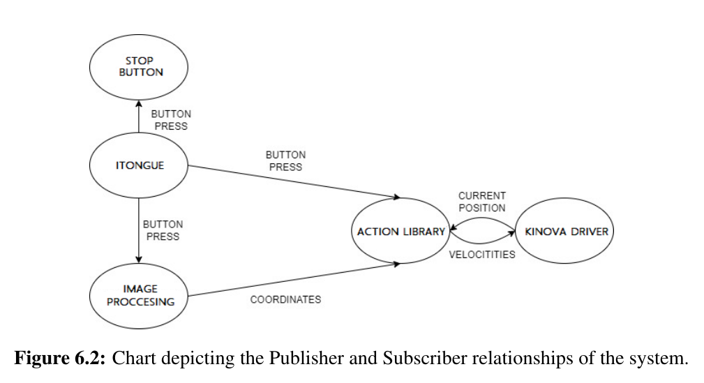

# P4_G461

AAU Robotics BSc, P4: A tongue controlled semi-autonomous system for individuals with tetraplegia
=================================================================================================

## Objectives
------------------------------------------
+ Learn how to provide a robot with the abilities to sense its environment and react to it
+ Learn to work with camera sensors and process their data
+ Learn the principles of computer vision and implement them
+ Learn OpenCV library
+ Practice ROS (Robot Operating System)
+ Get acquainted with the Konovo's JACO2 manipulator and Itongue (the communication with them is done using ROS)

## Project description
------------------------------------------
This project aims to have a tetraplegic user manipulate the JACO2 robotic arm with an Itongue, by using Bluetooth communication. There are two control modes available: manual and semi-autonomous. In order to build the semi-autonomous mode and have the robot able to interact with its surroundings, an optical infrared active stereo sensor was used (Intel RealSense D435i). The stereo specifications are necessary to compute depth data about the surrounding objects (i.e. distance to the objects). The infrared functionality makes sure data can be captured in poor light conditions. And structured infrared light (active stereo) accounts for problems encountered with structureless surfaces. Thus, the optical sensor provides data about the environment. The data - images/ video, is then processed and essential features are extracted using computer vision. One of the outputs is the location of the object in 3D space. The Itoungue is then used to send pick-up commands to the JACO2 during semi-autonomous mode or manually move it to the pick-up target. There are in total five main ROS nodes which are communicating with each other, with the relationship presented in the image below. Additionally, a classifier is made to distinguish between bottle and not bottle objects. The goal behind having such a classifier is to increase the speed of the system by predefining movements for specific types of objects. 

**Used tools:** JACO2 SDK, Python, OpenCV, ROS, Itongue SDK
**Resources:** Introduction to Video and Image Processing (2012) - Thomas B. Moeslund, [OpenCV documentation index](https://docs.opencv.org/)

**Used hardware:** Intel RealSense D435i, Itongue, Kinovo JACO2

**Folder & file description:**
+ `processing/src/FinalVersion/` contains the Image processing part of the project with the ROS publisher and subscriber functions present in the file alignDepth2ColorAndGetRealFeed.py
+ `itongue` contains the control files for the JACO2 with the Itongue, with the main control scheme available in itounge/scripts/ActionLibrary.py
+ The training and test data used for the classifier can be found here: [Google Drive: Sign-in](https://drive.google.com/file/d/1a65BehZTE5N30WkVAhLkrKiOpGFYJDxD/view?usp=sharing)
+ the necessary package for the Itongue is found at itounge/src/RAWitonguetalker.py 
+ the necessary package for the JACO2 is the Kinovo driver that can be found on GitHub,[GitHub - Kinovarobotics/kinova-ros: ROS packages for Jaco2 and Mico robotic arms](https://github.com/Kinovarobotics/kinova-ros)

## How to use
------------------------------------------
It is necessary to have all the mentioned above hardware, a python interpreter, Open CV installed in a separate virtual environment, and ROS Kinovo version installed. 

To install OpenCV on Ubuntu: [How to install OpenCV 4 on Ubuntu - PyImageSearch](https://pyimagesearch.com/2018/08/15/how-to-install-opencv-4-on-ubuntu/)
